# Shell_Scripting

### **What is Shell Scripting?**

A shell script is a list of commands in a computer program that is run by the Unix shell which is a command line interpreter. A shell script usually has comments that describe the steps. The different operations performed by shell scripts are program execution, file manipulation and text printing. A wrapper is also a kind of shell script that creates the program environment, runs the program etc.

### **Why use Shell Scripting?**

- Batch jobs

    Several commands that would be entered manually in a command line interface can be executed automatically using a shell script. This can be done without the user needing to trigger each command separately.

- Generalisation

    It is much more flexible to use loops, variables etc for multiple tasks in shell script. An example of this is a Unix shell script known as bash, which converts jpg images to png images.

- Shortcuts

    There is a shortcut provided by a shell script for a system command where command options, environment settings or post processing apply. This still allows the shortcut script to act as a Unix command.
## Introduction to Shell and User Input

Shell scripts can be written in either a code editor like VSCode or you can use nano/ vim.
Since we want to keep our scripts we will be using VSCode. 

- Create a folder - `mkdir shell_scripting`
- cd into the folder - `desktop/shell_scripting`
- create the file for the shell script - `touch myscript.sh`
- open up VSCode - `code .`
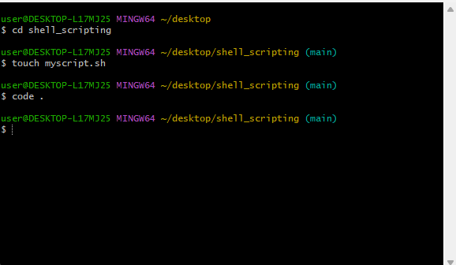

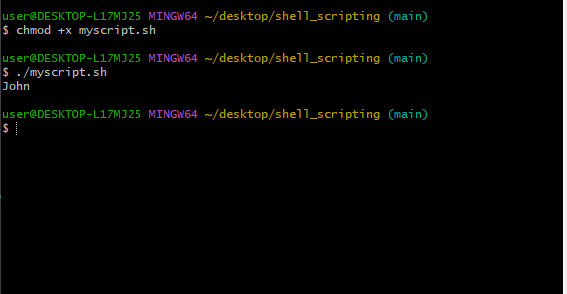

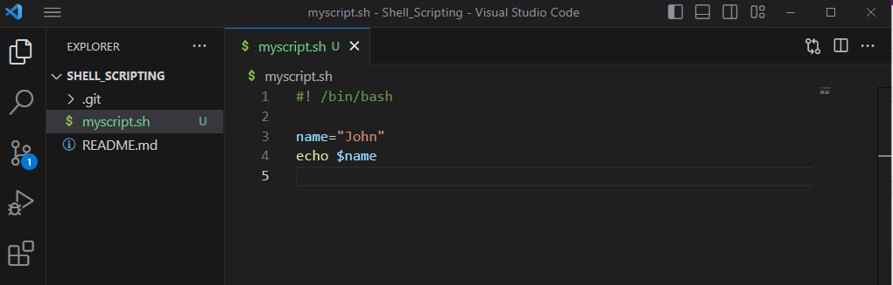

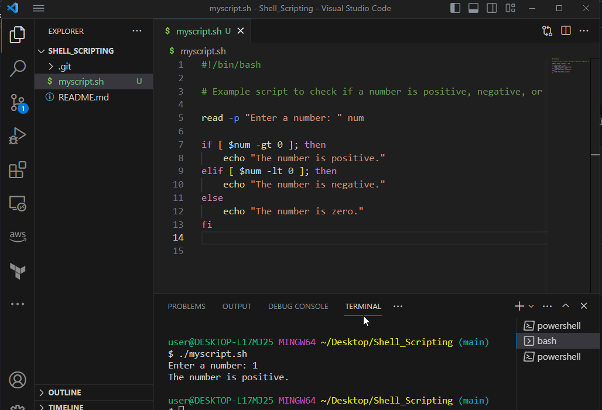

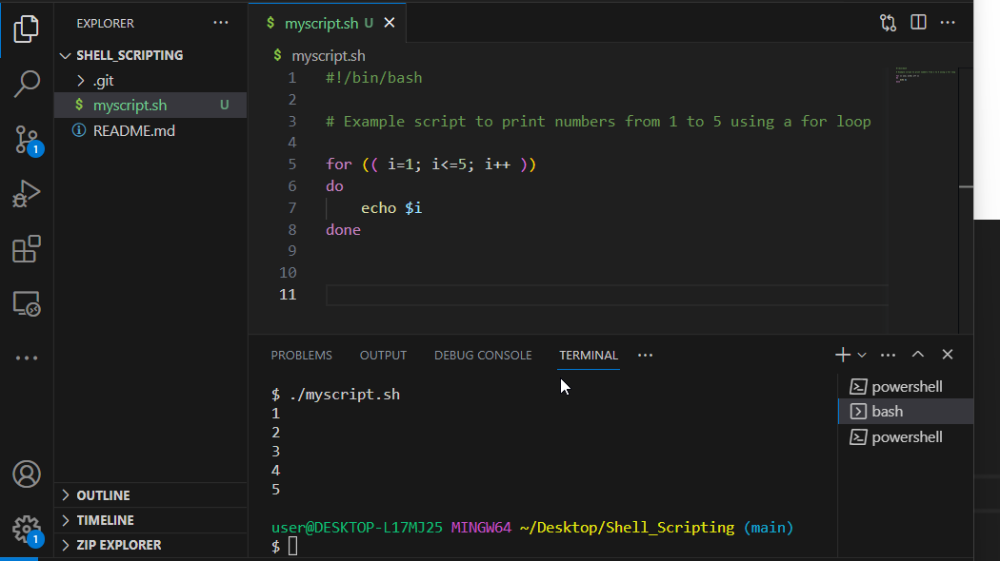

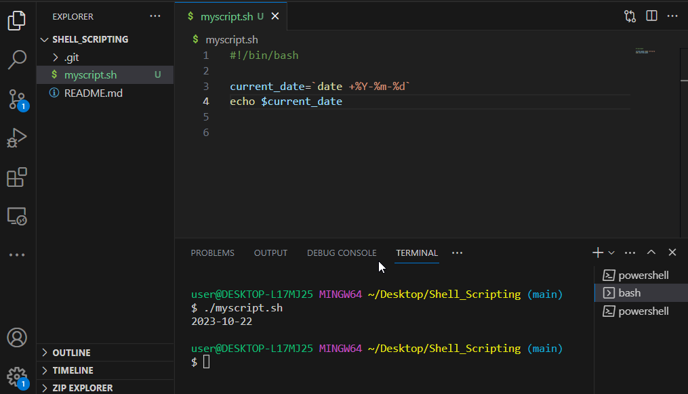

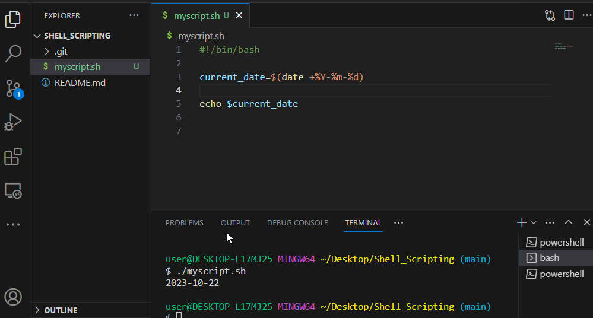

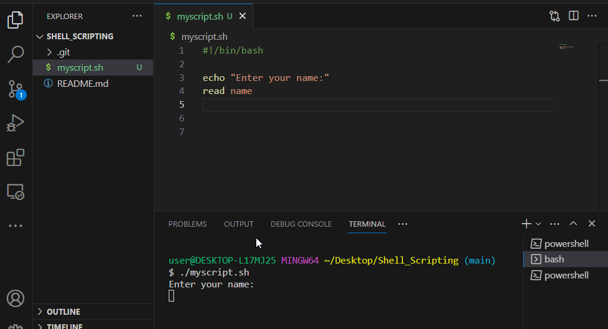

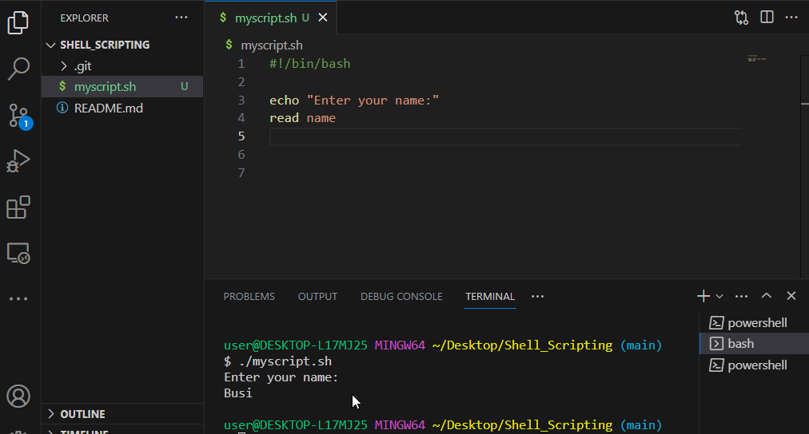

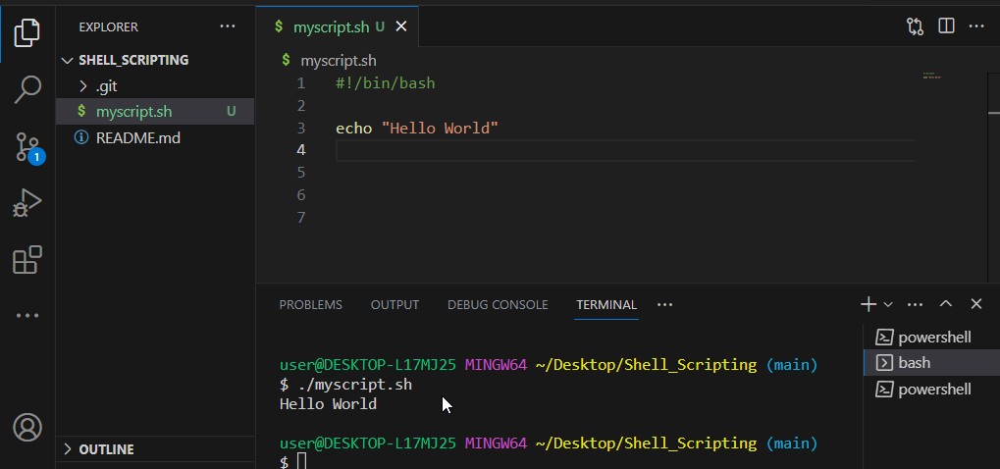

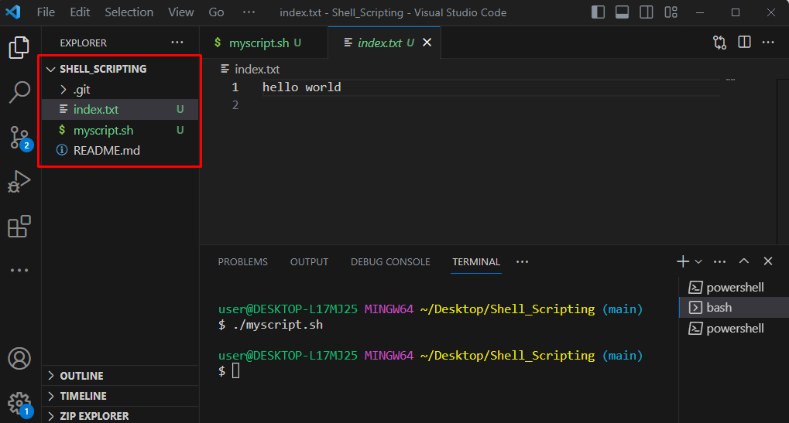

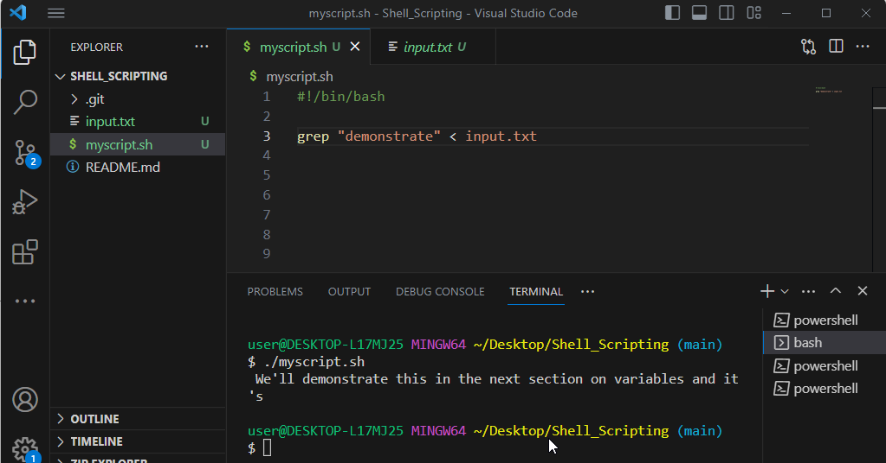

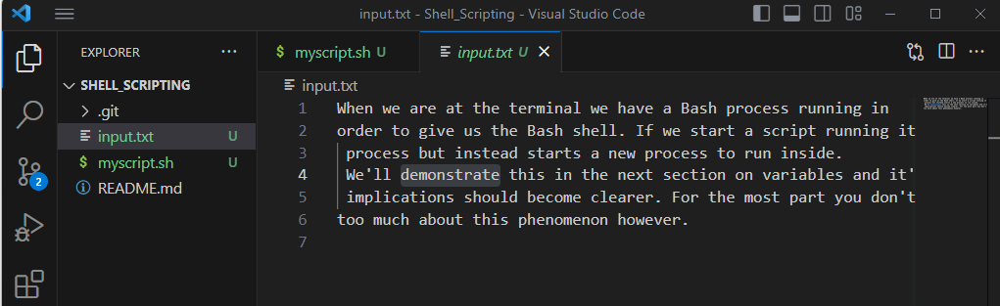

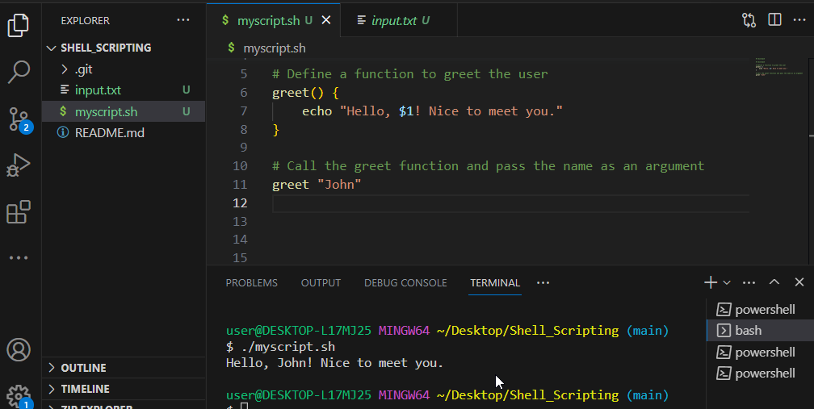

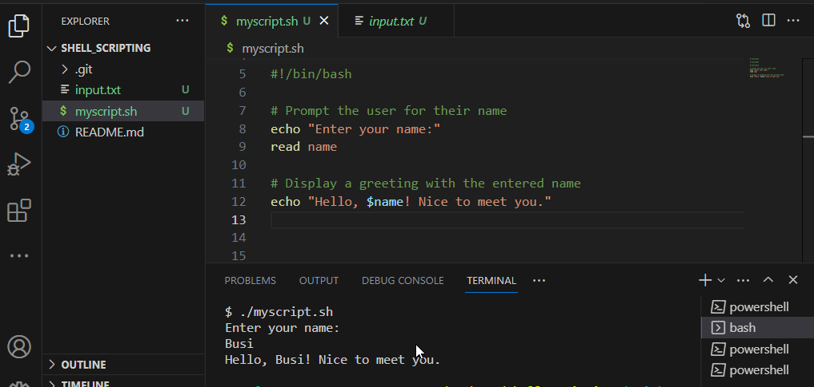

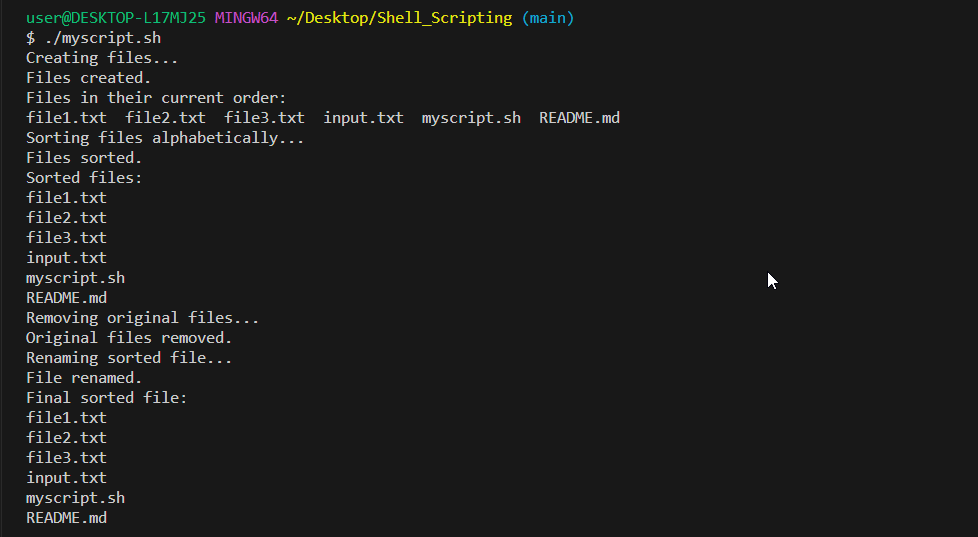

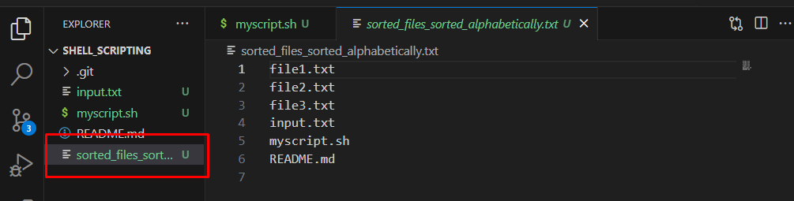

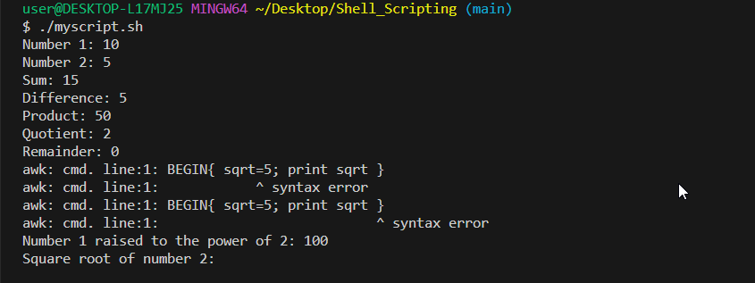

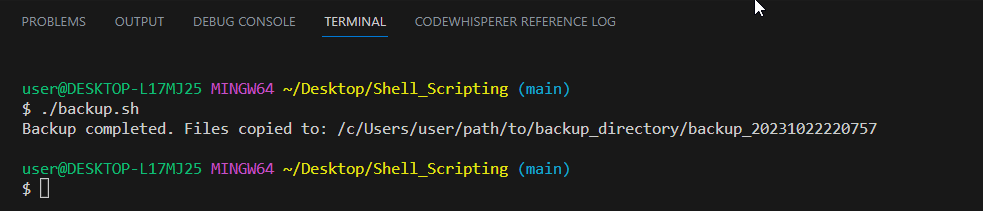