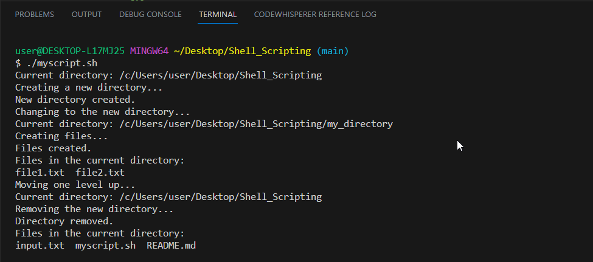

# Shell_Scripting

### **What is Shell Scripting?**

A shell script is a list of commands in a computer program that is run by the Unix shell which is a command line interpreter. A shell script usually has comments that describe the steps. The different operations performed by shell scripts are program execution, file manipulation and text printing. A wrapper is also a kind of shell script that creates the program environment, runs the program etc.

### **Why use Shell Scripting?**

- Batch jobs

    Several commands that would be entered manually in a command line interface can be executed automatically using a shell script. This can be done without the user needing to trigger each command separately.

- Generalisation

    It is much more flexible to use loops, variables etc for multiple tasks in shell script. An example of this is a Unix shell script known as bash, which converts jpg images to png images.

- Shortcuts

    There is a shortcut provided by a shell script for a system command where command options, environment settings or post processing apply. This still allows the shortcut script to act as a Unix command.
## Introduction to Shell Scripting and User Input

Shell scripts can be written in either a code editor like VSCode or you can use nano/ vim.
Since we want to keep our scripts we will be using VSCode. 

- Create a folder - `mkdir shell_scripting`
- cd into the folder - `desktop/shell_scripting`
- create the file for the shell script - `touch myscript.sh`
- open up VSCode - `code .`

## Shell Scripting Syntax

**Variables**: Variables are used to store information to be referenced, this can be of various types such as numbers, strings and arrays. You can assign values to variables using the **=** operator. To access the value of the variable use the **$** symbol e.g `$variable_name`

**Control Flow**: Bash **if-else** statements are used to perform conditional tasks in the sequential flow of execution of statements. Sometimes, we want to process a specific set of statements if a condition is true, and another set of statements if it is false. To perform such type of actions, we can apply the if-else mechanism.

**For loop** is a control structure that is used to perform repetitive tasks or execute a bunch of commands a specific number of times. With for loop, you can iterate through numbers, lists, files, or even directories.

**Input and Output**: The **read command**  is used to read input from the user or from a file and output the text using the echo command. You can also redirect input and output using operators like `>` output to a file, `<` input from a file, and `|`pipe the output of the one command as an input to another.

Here we have a script `echo Hello World` in our `myscript.sh` file, we will output the content into a new file `index.sh`

Below we see the content of `myscript.sh` in the new file

We can also pass the content of a file as input to a command.

`grep "demonstrate" < input.txt` - this will search for matching patterns in the `input.txt` file

**Functions**: Functions in bash scripting are a great option to reuse code. A Bash function can be defined as a set of commands which can be called several times within bash script. The purpose of function in bash is to help you make your scripts more readable and avoid writing the same code again and again.

